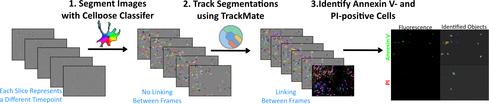
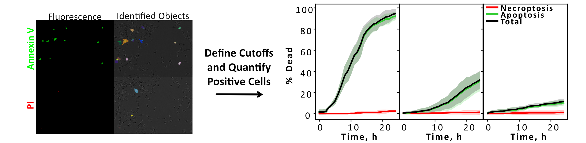
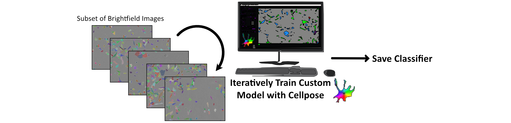

# FluoroFate

**A graphical user interface for time-resolved single-cell analysis of fluorescent reporter dynamics in multi-channel timelapse microscopy data.**

FluoroFate is a point-and-click desktop application that takes multi-channel timelapse TIFF images and performs automated cell segmentation, tracking, fluorescence thresholding, and temporal fate classification — all without requiring the user to write any code. The interface is built on [napari](https://napari.org/), providing interactive visualisation of every stage of the analysis so that results can be inspected and verified before export.

The tool was developed to enable researchers without programming experience to perform rigorous, reproducible single-cell fluorescence quantification. It integrates established image analysis tools — [Cellpose](https://www.cellpose.org/) for segmentation and [TrackMate](https://imagej.net/plugins/trackmate/) for tracking — into a unified workflow with a consistent graphical interface, removing the need to move data between different software packages or write custom analysis scripts.

FluoroFate is generalisable to any combination of fluorescence channels and cell fate question. While the work accompanying this tool used Annexin V and propidium iodide (PI) to classify apoptotic and necroptotic cell death, the tool is equally applicable to FUCCI cell-cycle reporter analysis or any experiment in which fluorescent signals must be assigned to individual tracked cells over time.

---

## Overview of the Analysis Pipeline

The pipeline integrates brightfield-based cell segmentation, cell tracking, fluorescence thresholding, and temporal fate classification into a single analysis framework. Each stage can be run independently or as a complete end-to-end analysis.



### Stage 1: Cell Segmentation

Brightfield images are segmented frame-by-frame using Cellpose. Cell diameter is estimated automatically from the first frame, and a lower-bound cell area can be set to exclude debris or small artefacts. Either a pretrained Cellpose model or a user-supplied custom model can be used. GPU acceleration is supported when available. Segmentation outputs are saved as labelled mask stacks for downstream tracking.

### Stage 2: Cell Tracking

Segmented objects are linked across time using TrackMate, which is run headlessly through PyImageJ — there is no need to open FIJI or interact with Java directly. Cell tracks are linked using the Cellpose-identified cell masks and the Advanced Kalman Tracker. Configurable tracking parameters include the initial linking radius, Kalman search radius, and maximum frame gap (the number of frames a cell can disappear before its track is closed). Optional track splitting and merging can be enabled to support lineage-aware analyses, in which mother-daughter relationships are inferred from TrackMate's edge structure and converted into hierarchical lineage identifiers. A relabelled stack with consistent cell identities across time is generated from the segmentation masks and TrackMate output.

### Stage 3: Fluorescence Thresholding and Fate Assignment

Fluorescence analysis can be performed on up to three user-defined channels. Each fluorescence channel is Gaussian-blurred and thresholded independently using one of several selectable global thresholding methods. Binary positive masks are generated for each frame and channel, and the overlap between positive pixels and each tracked cell mask is quantified using the centroid of each thresholded fluorescence object. In addition to fluorescence positivity, cell area and roundness are measured from the tracked masks, where roundness is defined as the ratio of the minor to major axis lengths of the equivalent ellipse.

Each tracked cell is then classified using one of two analysis modes (described in detail below), and the results are exported as CSV files and publication-ready PDF plots.



---

## Installation (No Coding Required)

> **For experienced Python users:** create the conda environment from `fluorofate_environment.yml`, activate it, and run `fluorofate.ipynb` or `python fluorofate.py` in your preferred editor. The detailed instructions below are for users who have not done this before.

FluoroFate has been designed so that users with no prior coding experience can install and run it by following the steps below. All dependencies are handled automatically by the provided environment file — there is nothing to configure manually.

### 1. Install Miniconda

Download and install [Miniconda](https://docs.conda.io/en/latest/miniconda.html). This is a lightweight package manager that will handle all of FluoroFate's software dependencies. Run the installer and accept the default settings. Once installed, you should be able to open **Anaconda Prompt** from the Start menu (Windows) or run `conda` in any terminal (Mac/Linux).

### 2. Install Visual Studio Code

Download and install [Visual Studio Code](https://code.visualstudio.com/) (VS Code). This is a free code editor that can run Jupyter notebooks — which is how FluoroFate is launched. Once VS Code is open:

1. Open the **Extensions** panel (the square icon on the left sidebar, or press `Ctrl+Shift+X`).
2. Search for and install the **Python** extension (published by Microsoft).
3. Search for and install the **Jupyter** extension (published by Microsoft).

### 3. Create the FluoroFate Environment

Open a terminal inside VS Code (**Terminal → New Terminal**, or press `` Ctrl+` ``). Navigate to the folder containing this README and run:

```bash
cd path/to/Annexin_V_Incucyte_Analysis
conda env create -f fluorofate_environment.yml
```

Replace `path/to/Annexin_V_Incucyte_Analysis` with the actual path on your computer. This command installs Python, napari, Cellpose, PyImageJ, Java, and all required scientific libraries into a self-contained environment called `fluorofate_environment`. This step only needs to be performed once.

### 4. Select the Environment in VS Code

1. Open the file `fluorofate.ipynb` in VS Code (File → Open File, or drag the file into the VS Code window).
2. In the top-right corner of the notebook, click the **kernel picker** (it may display "Select Kernel" or a Python version).
3. Select **Python Environments → fluorofate_environment**. If it does not appear immediately, click "Refresh" or restart VS Code.

### 5. Launch FluoroFate

With `fluorofate.ipynb` open and the `fluorofate_environment` kernel selected, click the **Run All** button at the top of the notebook (the double-play ▶▶ icon). The FluoroFate graphical interface will open in a napari window.

### Input Data Format

FluoroFate accepts **4-D TIFF** files with shape `(T, C, Y, X)` — time, channels, height, width. At least one brightfield channel and one fluorescence channel are required. Supported file extensions: `.tif`, `.tiff`.

---

## Training a Custom Cellpose Model (Optional)

Depending on the cell type, one of the [standard Cellpose models](https://cellpose.readthedocs.io/en/latest/models.html) may perform well without modification. However, if the default models do not segment your cells accurately, training a custom model is straightforward and typically produces a substantial improvement.



To train a custom model:

1. Select a small subset of representative brightfield images from your dataset.
2. Open them in the [Cellpose GUI](https://www.cellpose.org/) and iteratively train a custom model. A [video tutorial](https://www.youtube.com/watch?v=5qANHWoubZU) is available that walks through this process.
3. Save the trained model file (`.pt` or `.pth` format).

An example custom model is included in the `Example_Custom_Cellpose_Model` folder for reference.

To use a custom model in FluoroFate: in the **Analysis** panel, click the file picker next to **Select file (optional custom model)** and select your model file. The built-in model dropdown will be disabled automatically.

---

## Graphical Interface

The FluoroFate interface is organised into configuration panels on the right side of the napari viewer. All parameters have sensible defaults and can be adjusted without writing any code.

### Files Panel

| Parameter | Description |
|---|---|
| Single TIFF | Path to one multi-channel timelapse TIFF |
| Batch folder | Folder of TIFFs (for batch processing) |
| Output directory | Where results are saved (defaults to a subfolder next to the input image) |

### Channels Panel

Up to three fluorescence channels can be configured. Each channel has an associated name (used in all output files and plots), a channel index, and a thresholding method.

| Parameter | Default | Description |
|---|---|---|
| Brightfield channel | -1 (last) | Channel index for brightfield |
| Fluorophore 1 name | Green | Label used in output columns and filenames |
| Fluorophore 1 channel | 0 | Channel index |
| Fluorophore 1 threshold | otsu | Thresholding method |
| Fluorophore 2 name | Red | Label used in output columns and filenames |
| Fluorophore 2 channel | 1 | Channel index |
| Fluorophore 2 threshold | otsu | Thresholding method |
| Fluorophore 3 name | *(blank)* | Leave blank to use only two channels |
| Fluorophore 3 channel | 2 | Channel index |
| Fluorophore 3 threshold | otsu | Thresholding method |

### Analysis Panel

| Parameter | Default | Description |
|---|---|---|
| Analysis mode | persistent | `persistent` or `snapshot` — see [Analysis Modes](#analysis-modes) below |
| Blur sigma | 1.0 | Gaussian blur sigma applied before thresholding |
| Custom model file | *(empty)* | Optional `.pt`/`.pth` Cellpose model; overrides the built-in model |

### Cellpose Panel

| Parameter | Default | Description |
|---|---|---|
| Model | cpsam | Built-in Cellpose model (disabled when a custom model is selected) |
| Min cell size | 15 | Minimum object area in pixels |
| Use GPU | True | Enable GPU acceleration |

### TrackMate Panel

| Parameter | Default | Description |
|---|---|---|
| Init search radius | 30.0 | Initial linking distance (pixels) |
| Search radius | 150.0 | Kalman filter search radius (pixels) |
| Max frame gap | 3 | Maximum number of frames a cell can be absent before the track is terminated |
| Allow splitting | False | Enable detection of cell division events |
| Splitting max distance | 15.0 | Maximum distance for splitting links (pixels; only used when splitting is enabled) |
| Allow merging | False | Enable detection of cell fusion events |

---

## Running the Analysis

The workflow can be run either stepwise (for inspection and parameter adjustment between stages) or as a complete end-to-end analysis on a single image. Batch processing of all files within a folder is also supported.

| Button | Function |
|---|---|
| **1) Run Segmentation** | Cellpose segmentation only; saves `masks_stack.tiff` |
| **2) Run Tracking** | TrackMate tracking from saved masks; saves `linked_labels_trackmate.tiff` and `trackmate_tracks.csv` |
| **3a) Run Persistent Analysis** | Persistent fate assignment and plot generation from saved tracking |
| **3b) Run Snapshot Analysis** | Snapshot fate assignment and plot generation from saved tracking |
| **Run All (Single Image)** | Complete pipeline on one image (segmentation → tracking → both analysis modes) |
| **Analyse All in Folder** | Batch processing of every TIFF in a folder; saves a combined `batch_summary.csv` |
| **Save Results** | Export accumulated results to a user-selected CSV |

Because each stage saves its intermediate outputs, analysis parameters (such as thresholding method or analysis mode) can be adjusted and the analysis re-run without repeating segmentation or tracking.

---

## Analysis Modes

Two complementary analysis modes are available, corresponding to different biological questions.

### Persistent Mode

In persistent mode, each tracked cell is assigned a permanent fate according to the first fluorophore signal detected during the timelapse. Cells are defined by the first colour that they become positive for, regardless of fluorescence intensities at later time points. For each fluorophore, the first positive frame and total positive area across the track are recorded.

This mode is appropriate when the order of fluorescence appearance determines the biological outcome. For example, in cell-death assays:
- A cell that becomes Annexin V-positive first → **apoptosis**
- A cell that becomes PI-positive first (without prior Annexin V positivity) → **necroptosis**

Persistent mode generates cumulative percentage curves showing the proportion of cells assigned to each fate over time. These curves can only increase, since fate assignments are irreversible.

### Snapshot Mode

In snapshot mode, cells are classified independently at each frame according to the set of fluorophores active at that time point. Categories are formed by combining the names of currently active fluorophores (e.g. `Green`, `Red`, `Green+Red`, `negative`).

This mode is appropriate for analyses in which cell states change dynamically over time, such as FUCCI-based cell-cycle reporter datasets where cells transition between G1 (red) and S/G2/M (green) phases. The percentage curves in snapshot mode can both increase and decrease as cells move between states.

---

## Thresholding Methods

Each fluorophore channel can use a different global thresholding method, selected in the Channels panel. A Gaussian blur (controlled by the blur sigma parameter) is applied before thresholding to reduce noise.

| Method | Description |
|---|---|
| **mean** | Pixels above the image mean intensity are classified as positive |
| **otsu** | Otsu's method; minimises intra-class variance (suitable for bimodal intensity distributions) |
| **yen** | Yen's method; maximises correlation between original and thresholded images |
| **triangle** | Triangle algorithm; suitable for unimodal histograms with an extended tail |
| **minimum** | Histogram-based minimum method; assumes a bimodal distribution |

The thresholding method can be changed and the analysis re-run (using buttons 3a or 3b) without repeating segmentation or tracking.

---

## Output Files

All outputs are saved in a per-image subfolder under the output directory.

### Segmentation and Tracking Outputs

| File | Description |
|---|---|
| `masks_stack.tiff` | Cellpose segmentation masks (T, Y, X) |
| `linked_labels_trackmate.tiff` | Tracked label stack with consistent cell IDs across frames |
| `trackmate_tracks.csv` | Per-spot data: `track_id`, `t`, `y`, `x`, `quality`, `lineage_id`, `parent_track_id`, `generation` |
| `trackmate_tracks_by_cell.csv` | Same data with `cell_id` (= track_id + 1) and `frame` columns |
| `lineage_summary.csv` | One row per track: lineage ID, parent track, generation, first/last frame, number of frames |

### Persistent Mode Outputs

| File | Description |
|---|---|
| `assignments_persistent.csv` | Per-cell fate, first-positive frame, and positive area per fluorophore |
| `persistent_by_cell.csv` | Same with `cell_id`, `track_id`, and lineage columns |
| `percentages_persistent.csv` | Cumulative percentage of positive cells per frame |
| `percentages_persistent.pdf` | Line plot of cumulative percentages |
| `percentages_persistent_{N}pct.csv/pdf` | Filtered to cells present in ≥N% of frames (N = 30, 40, 50, 60) |

### Snapshot Mode Outputs

| File | Description |
|---|---|
| `snapshot.csv` | Per-cell per-frame category, boolean flags, and positive area per fluorophore |
| `snapshot_by_cell_long.csv` | Long-format data with `cell_id`, `track_id`, `frame`, `category`, and lineage columns |
| `snapshot_by_cell_wide.csv` | Wide-format data: one row per cell, one column per frame category |
| `percentages_snapshot.csv` | Per-frame category percentages |
| `percentages_snapshot.pdf` | Line plot of category percentages |
| `percentages_snapshot_{N}pct.csv/pdf` | Filtered to cells present in ≥N% of frames |
| `snapshot_trajectories_{N}pct.pdf` | Spatial trajectory plots coloured by category |
| `snapshot_timelines_{N}pct.pdf` | Swimlane timeline plots showing each cell's classification over time |

### Notes on Output Data

- **All CSV files include every tracked cell** regardless of track length. Frame-presence filtering (30%, 40%, 50%, 60%) is applied only to the filtered output plots and their corresponding CSV files.
- **Positive area columns** (`{fluorophore}_positive_area`) report the number of thresholded positive pixels overlapping each cell mask — per fluorophore per frame (snapshot mode) or summed across all frames (persistent mode).
- **Lineage columns** (`lineage_id`, `parent_track_id`, `generation`) are populated when TrackMate splitting is enabled. Lineage IDs use dotted notation (e.g. `1`, `1.1`, `1.2`) to group mother and daughter cells.

---

## Troubleshooting

- **GPU acceleration** is recommended for Cellpose segmentation. If a CUDA-capable GPU is not available, segmentation will still run on the CPU.
- **Java not found:** The environment file includes Java dependencies. If TrackMate reports a missing JVM, ensure that the `fluorofate_environment` conda environment is active.
- **Re-running analysis without re-segmenting:** Intermediate outputs (`masks_stack.tiff`, `linked_labels_trackmate.tiff`) are saved after each stage, so the analysis can be re-run with different parameters without repeating segmentation or tracking.
- **Batch processing** applies the same settings to every TIFF in a folder and produces a combined `batch_summary.csv` alongside per-image outputs.
- **Colour assignment** is automatic: fluorophore names containing colour keywords (e.g. "Red", "Green") are matched to corresponding plot colours. Names without a recognised colour keyword are assigned unused colours from a default palette.
